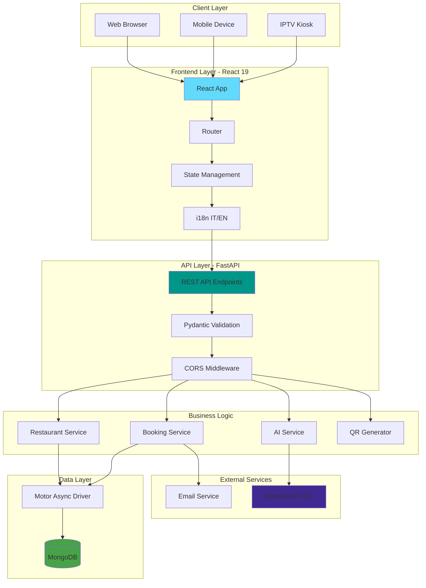
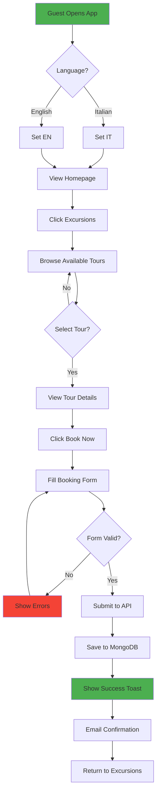
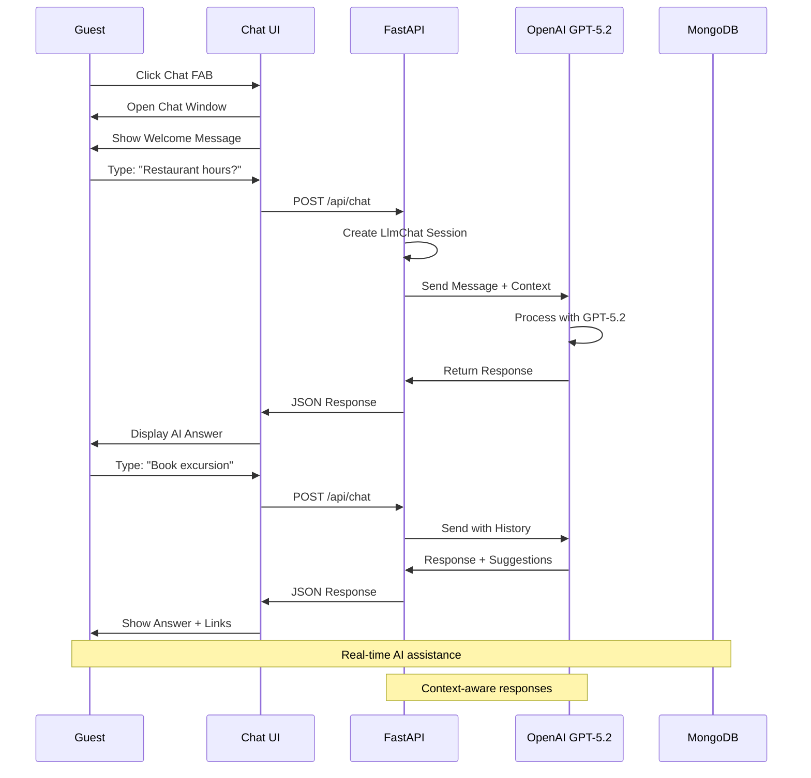
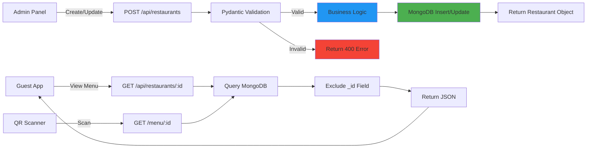
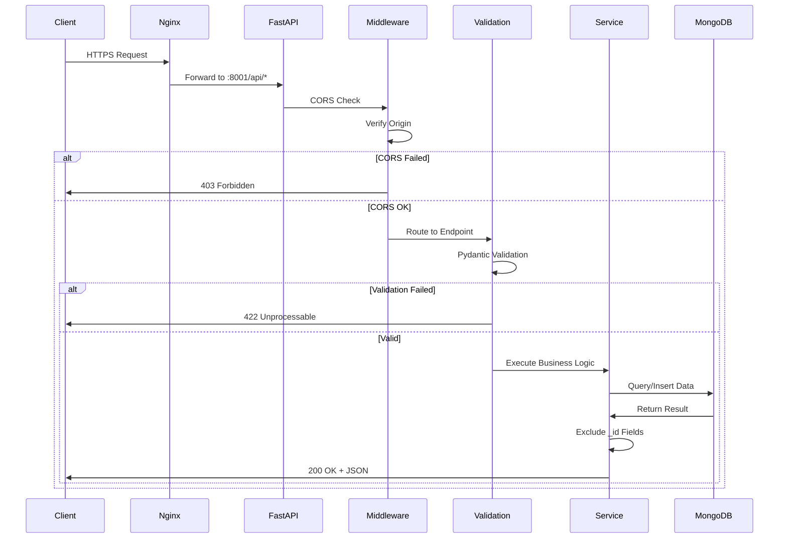
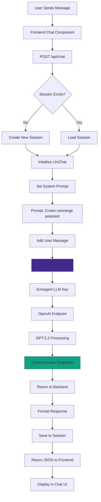
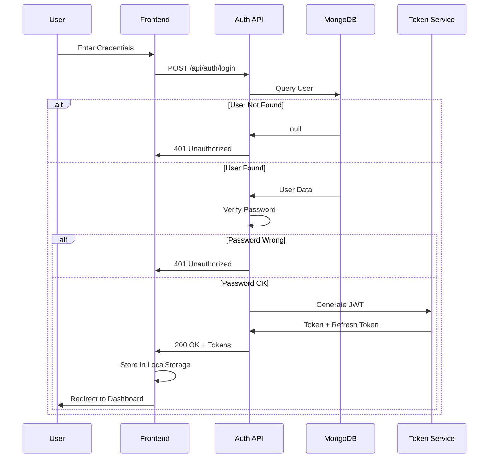
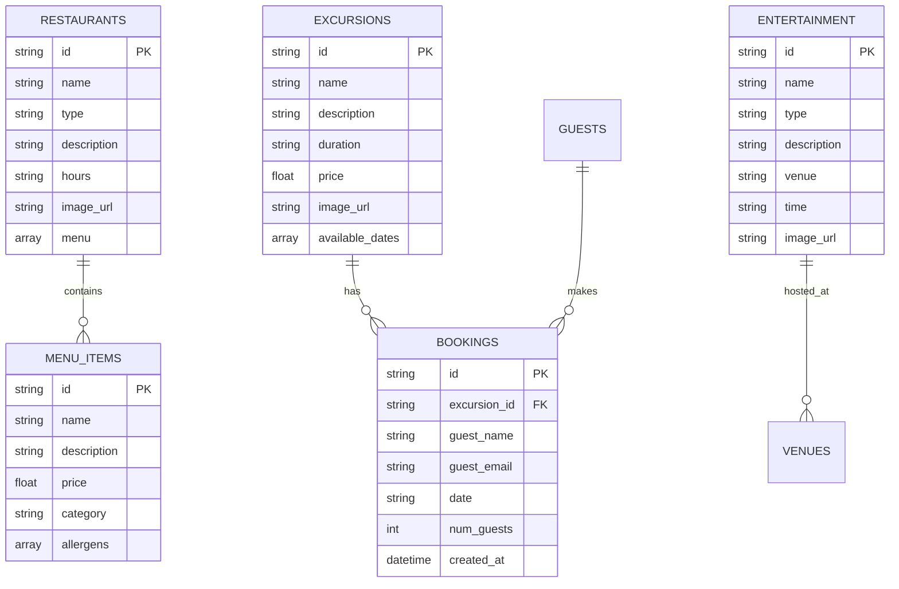

# 🚢 Cruise Ship Hospitality CMS - Complete Flowcharts

**Project by:** Carmine D'Alise  
**Date:** December 2025  
**Version:** 1.0

---

## 📋 Table of Contents

1. [System Architecture](#system-architecture)
2. [User Flow Diagrams](#user-flow-diagrams)
3. [Data Flow Diagrams](#data-flow-diagrams)
4. [API Flow](#api-flow)
5. [AI Integration Flow](#ai-integration-flow)
6. [Booking System Flow](#booking-system-flow)
7. [Authentication & Session Flow](#authentication--session-flow)

---

## 🏗️ System Architecture

### High-Level Architecture



### ASCII Architecture

```
┌─────────────────────────────────────────────────────────────┐
│                     CLIENT DEVICES                          │
│  [Web Browser]    [Mobile]    [IPTV Kiosk]                │
└──────────────────────┬──────────────────────────────────────┘
                       │ HTTPS/REST
                       ↓
┌─────────────────────────────────────────────────────────────┐
│              FRONTEND - React 19 + Tailwind                 │
│  ┌──────────┐  ┌──────────┐  ┌──────────┐  ┌──────────┐  │
│  │ Home     │  │Restaurant│  │Excursions│  │ Kiosk    │  │
│  │ Page     │  │ & Menus  │  │ Booking  │  │ Mode     │  │
│  └──────────┘  └──────────┘  └──────────┘  └──────────┘  │
│  ┌──────────────────────────────────────────────────────┐  │
│  │        ChatBot (AI Assistant)                        │  │
│  │        Navigation (Multi-language IT/EN)            │  │
│  └──────────────────────────────────────────────────────┘  │
└──────────────────────┬──────────────────────────────────────┘
                       │ Axios HTTP
                       ↓
┌─────────────────────────────────────────────────────────────┐
│              BACKEND - FastAPI + Python                     │
│  ┌──────────┐  ┌──────────┐  ┌──────────┐  ┌──────────┐  │
│  │ REST API │  │ Pydantic │  │   CORS   │  │   Auth   │  │
│  │ /api/*   │  │Validation│  │Middleware│  │ (Future) │  │
│  └──────────┘  └──────────┘  └──────────┘  └──────────┘  │
│  ┌────────────────────────────────────────────────────┐    │
│  │            Business Logic Services                 │    │
│  │  • Restaurant Management  • Booking System         │    │
│  │  • AI Chat Integration   • QR Code Generator      │    │
│  │  • Menu Management       • Entertainment Catalog  │    │
│  └────────────────────────────────────────────────────┘    │
└──────────────────────┬──────────────────────────────────────┘
                       │
        ┌──────────────┼──────────────┐
        │              │              │
        ↓              ↓              ↓
┌─────────────┐ ┌─────────────┐ ┌─────────────┐
│  MongoDB    │ │  OpenAI     │ │   Email     │
│  NoSQL DB   │ │  GPT-5.2    │ │  Service    │
│  Collections│ │  AI API     │ │  (Future)   │
└─────────────┘ └─────────────┘ └─────────────┘
```

---

## 👤 User Flow Diagrams

### 1. Guest Browsing & Booking Excursion



### 2. Restaurant Menu Access via QR Code

```
┌─────────────┐
│ Guest Scans │
│  QR Code    │
└──────┬──────┘
       │
       ↓
┌──────────────────┐
│ Smartphone Opens │
│ Menu URL         │
└──────┬───────────┘
       │
       ↓
┌──────────────────┐
│ GET /menu/:id    │
│ from Backend     │
└──────┬───────────┘
       │
       ↓
┌──────────────────┐
│ Fetch Restaurant │
│ + Menu Data      │
│ from MongoDB     │
└──────┬───────────┘
       │
       ↓
┌──────────────────┐
│ Render Menu by   │
│ Categories:      │
│ • Antipasti      │
│ • Primi          │
│ • Secondi        │
│ • Desserts       │
└──────┬───────────┘
       │
       ↓
┌──────────────────┐
│ Guest Views Menu │
│ with Prices &    │
│ Allergen Info    │
└──────────────────┘
```

### 3. AI Chatbot Interaction Flow



### 4. Kiosk Mode Flow

```
     ┌──────────────┐
     │ Kiosk Starts │
     │ Idle Screen  │
     └──────┬───────┘
            │
            ↓
     ┌──────────────┐
     │ Detect Touch │
     └──────┬───────┘
            │
            ↓
     ┌──────────────┐
     │ Show Menu    │
     │ Grid:        │
     │ ┌───┬───┬───┐│
     │ │ 🍽️│ 🏝️│ 🎭││
     │ ├───┼───┼───┤│
     │ │ 📡│ ℹ️│ 🏠││
     │ └───┴───┴───┘│
     └──────┬───────┘
            │
            ↓
     ┌──────────────┐
     │ User Selects │
     │ Category     │
     └──────┬───────┘
            │
     ┌──────┴───────┐
     │              │
     ↓              ↓
┌──────────┐  ┌──────────┐
│Navigate  │  │  Return  │
│to Section│  │ to Idle  │
│          │  │  (30sec) │
└──────────┘  └──────────┘
```

---

## 📊 Data Flow Diagrams

### Restaurant Management Data Flow



### Booking System Data Flow

```
┌─────────────┐
│   Guest     │
│   Form      │
└──────┬──────┘
       │ {name, email, date, guests}
       ↓
┌──────────────────┐
│ POST /api/       │
│ bookings         │
└──────┬───────────┘
       │
       ↓
┌──────────────────┐
│ Pydantic Model   │
│ Validation       │
│ • email format   │
│ • date valid     │
│ • guests > 0     │
└──────┬───────────┘
       │
       ├─[Invalid]──→ Error 422
       │
       ↓ [Valid]
┌──────────────────┐
│ Generate UUID    │
│ Add Timestamp    │
└──────┬───────────┘
       │
       ↓
┌──────────────────┐
│ MongoDB Insert   │
│ bookings         │
│ collection       │
└──────┬───────────┘
       │
       ↓
┌──────────────────┐
│ Return Booking   │
│ Confirmation     │
└──────┬───────────┘
       │
       ↓
┌──────────────────┐
│ Email Service    │
│ (Future)         │
└──────────────────┘
```

---

## 🔌 API Flow

### Complete API Request Flow



### API Endpoints Map

```
/api/
├── GET  /                     # Health Check
├── POST /init-data            # Initialize Sample Data
│
├── /restaurants
│   ├── GET  /                 # List All
│   ├── GET  /:id              # Get One
│   └── POST /                 # Create (Admin)
│
├── /excursions
│   ├── GET  /                 # List All
│   └── POST /                 # Create (Admin)
│
├── /bookings
│   ├── POST /                 # Create Booking
│   └── GET  /                 # List All (Admin)
│
├── /entertainment
│   ├── GET  /                 # List Events
│   └── POST /                 # Create (Admin)
│
├── /packages
│   ├── GET  /                 # List Internet Packages
│   └── POST /                 # Create (Admin)
│
├── /services
│   ├── GET  /                 # List Guest Services
│   └── POST /                 # Create (Admin)
│
├── POST /chat                 # AI Chatbot
│   Input: {message, session_id}
│   Output: {response, session_id}
│
└── GET /qrcode/:restaurant_id # Generate QR Code
    Output: {qr_code: base64, url: string}
```

---

## 🤖 AI Integration Flow

### GPT-5.2 Chat Integration



### AI System Prompt

```python
system_message = """
You are a helpful cruise ship concierge assistant.

Help guests with information about:
- Restaurants (hours, menus, reservations)
- Excursions (availability, booking, details)
- Entertainment (show times, venues)
- Ship services (reception, spa, facilities)
- Internet packages (pricing, features)

Be:
- Friendly and professional
- Concise but informative
- Context-aware
- Multi-lingual (Italian/English)

Response format: Clear, helpful answers
"""
```

---

## 📱 Multi-Language Flow

### i18n Implementation

```
┌──────────────┐
│  User Opens  │
│     App      │
└──────┬───────┘
       │
       ↓
┌──────────────┐
│Check LocalStorage│
│ for language │
└──────┬───────┘
       │
  ┌────┴────┐
  │         │
  ↓         ↓
[IT]      [EN]
  │         │
  ↓         ↓
┌─────────────────┐
│ Load Translation│
│ Files:          │
│ • translations/ │
│   ├─ it.json    │
│   └─ en.json    │
└──────┬──────────┘
       │
       ↓
┌─────────────────┐
│ Render UI with  │
│ t('key') helper │
└──────┬──────────┘
       │
       ↓
┌─────────────────┐
│ User Clicks     │
│ Language Toggle │
└──────┬──────────┘
       │
       ↓
┌─────────────────┐
│ Switch Language │
│ Save to Storage │
│ Re-render UI    │
└─────────────────┘
```

---

## 🔐 Authentication Flow (Future)

### Proposed Auth Architecture



---

## 📈 Performance Flow

### Optimization Strategy

```
Client Request
      │
      ↓
┌─────────────┐
│  CDN Cache  │ ← Static Assets (Images, CSS, JS)
└─────┬───────┘
      │ [Miss]
      ↓
┌─────────────┐
│   Nginx     │ ← Reverse Proxy
└─────┬───────┘
      │
      ↓
┌─────────────┐
│   FastAPI   │ ← Async Handlers
│   (Async)   │
└─────┬───────┘
      │
      ↓
┌─────────────┐
│   Motor     │ ← Async MongoDB Driver
│  (Async)    │
└─────┬───────┘
      │
      ↓
┌─────────────┐
│  MongoDB    │ ← Indexed Queries
│   Indexes:  │
│   • id      │
│   • type    │
└─────────────┘

Optimizations:
✓ Async/Await throughout
✓ MongoDB connection pooling
✓ React code splitting
✓ Lazy loading routes
✓ Image optimization
✓ Tailwind CSS purging
```

---

## 🎯 Complete User Journey Map

### Guest Experience Flow

```
┌──────────────────────────────────────────────────────────────┐
│                    GUEST ARRIVAL                             │
│                                                              │
│  1. Opens App/Kiosk                                         │
│     ↓                                                        │
│  2. Selects Language (IT/EN)                                │
│     ↓                                                        │
│  3. Views Homepage                                          │
│     ├─→ Browse Restaurants → View Menus → Scan QR          │
│     ├─→ Browse Excursions → Book Tour                       │
│     ├─→ Check Entertainment → View Schedule                 │
│     ├─→ Guest Services → Get Information                    │
│     ├─→ Internet Packages → Purchase                        │
│     └─→ AI Chat → Ask Questions                             │
│                                                              │
│  4. Concurrent Activities:                                  │
│     • Chat with AI assistant for help                       │
│     • Switch languages anytime                              │
│     • Navigate between sections                             │
│                                                              │
│  5. Make Booking:                                           │
│     ↓                                                        │
│     Fill Form → Validate → Submit → Confirm                 │
│     ↓                                                        │
│     Email Confirmation (Future)                             │
│                                                              │
│  6. Return to Browse or Exit                                │
└──────────────────────────────────────────────────────────────┘
```

---

## 📊 Database Schema Flow

### MongoDB Collections Relationships



---

## 🔄 Deployment Flow

### Emergent Platform Deployment

```
┌─────────────────┐
│  Local /app/    │
│  Development    │
└────────┬────────┘
         │
         ↓
┌─────────────────┐
│ Click "Deploy"  │
│ in Emergent UI  │
└────────┬────────┘
         │
         ↓
┌─────────────────┐
│  Build Process  │
│  • Backend      │
│  • Frontend     │
│  • Dependencies │
└────────┬────────┘
         │
         ↓
┌─────────────────┐
│  Container      │
│  Creation       │
│  • Docker Image │
│  • Supervisor   │
└────────┬────────┘
         │
         ↓
┌─────────────────┐
│  Start Services │
│  • MongoDB      │
│  • Backend:8001 │
│  • Frontend:3000│
└────────┬────────┘
         │
         ↓
┌─────────────────┐
│  Nginx Proxy    │
│  • /api → 8001  │
│  • / → 3000     │
└────────┬────────┘
         │
         ↓
┌─────────────────┐
│  DNS Mapping    │
│  *.preview.     │
│  emergentagent  │
└────────┬────────┘
         │
         ↓
┌─────────────────┐
│   LIVE URL      │
│ cruise-cms.     │
│ preview.        │
│ emergentagent   │
│ .com            │
└─────────────────┘

Cost: 50 credits/month
Uptime: 24/7
SSL: Automatic
URL: Permanent
```

---

## 📋 Summary

This document provides complete flowcharts for:

✅ **System Architecture** - High-level and detailed views  
✅ **User Flows** - All major user journeys  
✅ **Data Flows** - How data moves through the system  
✅ **API Flows** - Request/response cycles  
✅ **AI Integration** - GPT-5.2 implementation  
✅ **Database Schema** - MongoDB relationships  
✅ **Deployment** - From code to production  

**Use Cases:**
- Technical presentations
- Client proposals
- Team onboarding
- Documentation
- Portfolio showcase

---

**Created by:** Carmine D'Alise  
**Project:** Cruise Ship Hospitality CMS  
**GitHub:** github.com/iacreatorcar/cruise-hospitality-cms  
**LinkedIn:** linkedin.com/in/carmine-d-alise-3b25024b
